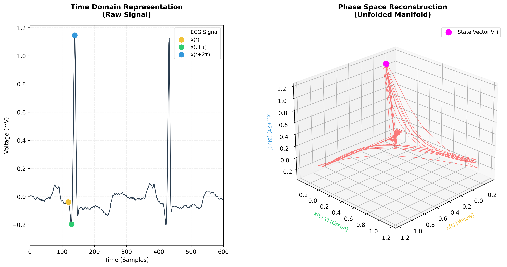
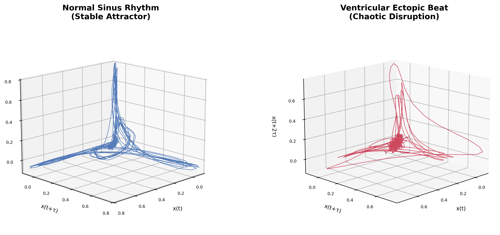
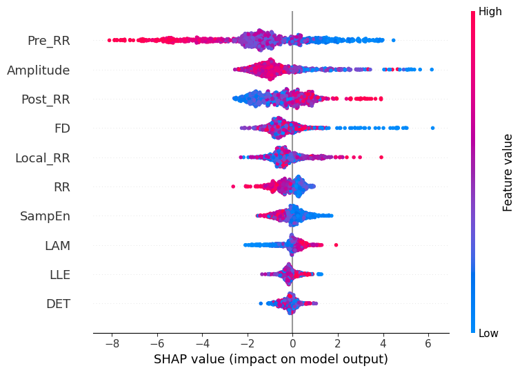

# Chaos-Enhanced Feature Engineering: A Data-Centric Framework for Efficient Time-Series Classification

[](https://www.python.org/downloads/)
[](https://opensource.org/licenses/MIT)

> **Thesis:** Complex neural networks are unnecessary for chaotic time-series classification. By "unfolding" signals into their phase-space representation and extracting physics-informed features, **any lightweight classifier** can match or outperform Deep Learning while being orders of magnitude faster.

---

## Key Results

| Methodology | Model | Accuracy | F1-Score | Inference (1k beats) |
|-------------|-------|----------|----------|---------------------|
| Traditional Baseline | Random Forest | 92.00% | 0.80 | ~20 ms |
| Modern Benchmark | 1D-CNN | 94.88% | 0.84 | ~1500 ms |
| **Proposed Framework** | **SVM (RBF)** | **95.25%** | **0.87** | **~250 ms** |
| **Proposed Framework** | **XGBoost** | **97.47%** | **0.93** | **~10 ms** |

**The Insight:** Both SVM and XGBoost—when given our chaos-enhanced features—surpass the Deep Learning benchmark. The performance gain comes from **better data representation**, not model complexity. Any classical classifier benefits; XGBoost simply extracts the most from the feature space.

---

## Abstract

The prevailing paradigm in time-series classification relies on high-complexity Deep Learning architectures to approximate non-linear decision boundaries. While effective, these models incur substantial computational cost and interpretability issues.

This work proposes a **Data-Centric** alternative rooted in **Nonlinear Dynamics (Chaos Theory)**. We argue that the perceived complexity of chaotic time-series is due to low-dimensional projection. Through **Phase Space Reconstruction** and the extraction of dynamical invariants—Largest Lyapunov Exponent, Higuchi Fractal Dimension, and Recurrence Quantification Analysis metrics—we "unfold" the data manifold into a structured, low-dimensional space.

Unlike blind dimensionality reduction (PCA, Autoencoders), this transformation performs **Semantic Compression**: converting 2000-point ECG windows into interpretable 10-dimensional feature vectors that preserve underlying system dynamics. This representation enables **any lightweight, interpretable model** to match or outperform Deep Learning, offering a scalable path for high-performance AI on resource-constrained edge devices.

---

## Core Concept: The Manifold Hypothesis

<p align="center">
  
</p>

**The Insight:** A chaotic 1D signal isn't random—it's a *projection* of a deterministic system operating on a lower-dimensional manifold. By reconstructing the phase space using Takens' Embedding Theorem, we can "unfold" this tangled trajectory into a geometric **attractor** where:

- **Normal Sinus Rhythm** → Stable, periodic attractor
- **Ventricular Ectopic Beat** → Chaotic, divergent attractor

The classification problem transforms from learning complex patterns in high-dimensional signal space to separating *geometrically distinct regions* on the manifold—a task achievable by simple classifiers.

---

## Methodology

### Three-Track Comparative Framework
```
                    MIT-BIH Arrhythmia Database
                              │
                    Common Preprocessing
                   (Filtering, Segmentation)
                              │
          ┌───────────────────┼───────────────────┐
          │                   │                   │
    Track 1: Traditional  Track 2: Modern   Track 3: Proposed
    Statistical Features   Deep Learning    Chaos + Statistics
          │                   │                   │
      4D Vector          2000 samples        10D Vector
    (RR intervals)       (Raw signal)      (Hybrid fusion)
          │                   │                   │
     Random Forest         1D-CNN         Classical ML Suite
          │                   │            (LR, SVM, XGBoost)
          └───────────────────┴───────────────────┘
                              │
                    Comparative Analysis
```

### Track 1: Traditional Baseline
- **Features:** Pre-RR interval, Post-RR interval, Local Average RR, R-peak Amplitude
- **Model:** Random Forest (100 estimators, max_depth=10)
- **Philosophy:** Arrhythmia is primarily a disruption of rhythm timing

### Track 2: Modern Benchmark  
- **Features:** Raw denoised ECG signal (2000 samples @ 360 Hz)
- **Model:** 1D-CNN (3 conv blocks: 32→64→128 filters, BatchNorm, MaxPool, GAP)
- **Philosophy:** Let the network learn everything from scratch

### Track 3: Proposed Chaos-Enhanced Framework

**Philosophy:** Arrhythmia is a dynamical system failure quantifiable through physics-based invariants. Transform the data so that *any* classical model can succeed.

#### The Hybrid Feature Vector (10D)

| Category | Features | What They Capture |
|----------|----------|-------------------|
| **Chaos Invariants** | LLE, FD, SampEn | Stability, complexity, regularity |
| **Recurrence Metrics** | RR, DET, LAM | Attractor density, predictability, intermittency |
| **Statistical** | Pre_RR, Post_RR, Local_RR, Amplitude | Timing and morphology |
```
Raw ECG Segment (2000 samples)
            │
    ┌───────┴───────┐
    │               │
Chaos Theory    Traditional Statistics
    │               │
Phase Space     R-Peak Detection
Reconstruction      │
    │           Timing & Morphology
Extract Invariants  │
    │               │
┌───┴───┐       ┌───┴───┐
LLE FD SampEn   Pre-RR Post-RR
RR DET LAM      Local-RR Amp
└───┬───┘       └───┬───┘
    │               │
    └───────┬───────┘
            │
    Feature Fusion
            │
  Hybrid Super-Vector (10D)
            │
    Any Classical Model
   (LR, SVM, XGBoost, etc.)
```

#### Why Feature Fusion?

This strategy is motivated by the **"Edge of Chaos"** hypothesis from nonlinear dynamics:

- **Statistical Features** → Capture the *periodic/ordered* component (the "clock")
- **Chaos Features** → Capture the *complexity/disordered* component (the "adaptability")

Together, they map the signal onto the full Order-Disorder spectrum, detecting pathologies at either extreme—excessive regularity (heart failure) or excessive stochasticity (fibrillation).

---

## Results

### Performance Comparison

<p align="center">
  
</p>

| Methodology | Model | Accuracy | Sensitivity | Specificity | F1-Score |
|-------------|-------|----------|-------------|-------------|----------|
| Traditional | Random Forest | 92.00% | 91.9% | 91.9% | 0.80 |
| Modern | 1D-CNN | 94.88% | 90.2% | 95.0% | 0.84 |
| Proposed | Logistic Regression | 79.42% | 74.9% | 80.0% | 0.56 |
| **Proposed** | **SVM (RBF)** | **95.25%** | **94.6%** | **95.0%** | **0.87** |
| **Proposed** | **XGBoost** | **97.47%** | **96.0%** | **97.8%** | **0.93** |

### What the Results Tell Us

The progression across classifiers on our chaos-enhanced features reveals the **topology of the feature space**:

| Model | Result | Interpretation |
|-------|--------|----------------|
| Logistic Regression | 79.4% | Decision boundary is **non-linear** (features don't make it trivially separable) |
| SVM (RBF) | 95.2% | Feature space has **smooth geometric structure** (kernel methods resolve it) |
| XGBoost | 97.5% | **Hierarchical decision rules** best capture feature interactions |

**Key Finding:** Even the SVM—a decades-old algorithm—beats the modern CNN when given the right features. The XGBoost result (97.47%) represents the ceiling of what classical models can extract, but **the framework's value is model-agnostic**.

### Efficiency Analysis

<p align="center">
  
</p>

| Model | Inference Latency | Latency Reduction vs CNN |
|-------|-------------------|--------------------------|
| 1D-CNN | ~1500 ms | — |
| SVM (RBF) | ~250 ms | 83% |
| Random Forest | ~20 ms | 98.7% |
| XGBoost | ~10 ms | 99.3% |

All proposed-track models operate in the **Real-Time Zone** (<100ms), enabling deployment on edge devices without GPU acceleration.

---

## Explainability (SHAP Analysis)

<p align="center">
  
</p>

### Key Insights

1. **Dominance of Timing (`Pre_RR`):** The interval preceding a beat is the strongest predictor—low values (premature beats) push strongly toward anomaly classification.

2. **Validation of Chaos Theory:** `FD` (Fractal Dimension) and `SampEn` rank among top predictors. Low complexity (blue dots for FD) drives SHAP values to +6.0, corresponding to **99.7% anomaly probability**. This confirms that *loss of signal complexity* is a definitive diagnostic marker.

3. **Structural Confirmation:** `RR` (Recurrence Rate) significance proves the model leverages phase-space attractor density, not just simple statistics.

**Why This Matters:** Unlike CNN feature maps, every dimension in our feature space has a **physiological interpretation**—bridging the gap between algorithmic output and clinical reasoning.

---

## Theoretical Framework

### The Conservation of Complexity Hypothesis

We propose that the intrinsic difficulty of a classification task represents a **fixed information barrier**. The computational burden can be shifted between representation and model:
```
K(Solution) ≈ L(Representation) + L(Model)
```

| Approach | Representation Cost | Model Cost | Example |
|----------|---------------------|------------|---------|
| Model-Centric | Low | High | Deep Learning (CNN learns from raw signal) |
| **Data-Centric** | **High** | **Low** | **Our framework (physics extracts features)** |

### The Efficiency Sweet Spot

For a fixed performance target, system efficiency follows a **unimodal curve**:

| Regime | Description | Outcome |
|--------|-------------|---------|
| Implicit Learning | Model bears full burden | High accuracy, high latency (CNN) |
| **Sweet Spot** | Domain math + lightweight model | High accuracy, low latency (Chaos + SVM/XGBoost) |
| Over-Engineering | Excessive feature computation | Diminishing returns |

Our framework operates at the sweet spot: **domain-specific mathematics simplifies the decision boundary** enough for instant, interpretable classification.

---

## Project Structure
```
chaos-ecg-classification/
├── data/                   
│   ├── raw/                    # MIT-BIH Arrhythmia Database source files
│   └── processed/              # Generated feature sets
│       ├── 1_traditional/      # Statistical features (CSV)
│       ├── 2_modern/           # Raw signal arrays (NPY)
│       └── 3_proposed/         # Hybrid Chaos+Stats features (CSV)
│
├── models/                     # Trained models and artifacts
│   ├── 1_traditional/          # Random Forest (.pkl)
│   ├── 2_modern/               # 1D-CNN (.keras)
│   ├── 3_proposed_xgb/         # XGBoost (.pkl) + SHAP plots
│   └── final_charts/           # Comparative visualizations
│
├── src/                        # Core Library
│   ├── features/
│   │   ├── physics.py          # Chaos Engine: LLE, FD, SampEn, RQA
│   │   └── statistical.py      # R-R intervals, morphology
│   ├── config.py               # Hyperparameters and paths
│   └── data_loader.py          # MIT-BIH parsing (WFDB)
│
├── scripts/                    # Execution Pipelines
│   ├── 1_track_traditional/
│   │   ├── extract_features.py
│   │   └── train_rf.py
│   ├── 2_track_modern/
│   │   ├── prepare_data.py
│   │   └── train_cnn.py
│   ├── 3_track_proposed/
│   │   ├── 1_etl_combined.py   # Chaos + Stats feature extraction
│   │   ├── 2_train_lr.py       # Logistic Regression (linearity test)
│   │   ├── 2_train_svm.py      # SVM training
│   │   └── 2_train_xgb.py      # XGBoost training + SHAP
│   ├── generate_final_charts.py
│   ├── reconstruction_diagram.py
│   ├── reconstruction_simulation.py
│   └── reconstruction_comparison.py
│
├── requirements.txt
└── README.md
```

---

## Quick Start

### Prerequisites
```bash
# Python 3.10 required
pip install -r requirements.txt
```

**Key Dependencies:**
- `wfdb` — MIT-BIH database parsing
- `scipy` — Signal filtering
- `nolds` — Lyapunov exponent calculation
- `antropy` — Fractal dimension, entropy (Numba-accelerated)
- `pyrqa` — Recurrence quantification analysis
- `xgboost`, `scikit-learn` — ML models
- `shap` — Explainability

### Replication

#### 1. Download MIT-BIH Database
```bash
python scripts/download_mitbih.py
```

#### 2. Run All Tracks
```bash
# Track 1: Traditional Baseline
python scripts/1_track_traditional/extract_features.py
python scripts/1_track_traditional/train_rf.py

# Track 2: Modern Benchmark
python scripts/2_track_modern/prepare_data.py
python scripts/2_track_modern/train_cnn.py

# Track 3: Proposed Framework (all classifiers)
python scripts/3_track_proposed/1_etl_combined.py
python scripts/3_track_proposed/2_train_lr.py
python scripts/3_track_proposed/2_train_svm.py
python scripts/3_track_proposed/2_train_xgb.py
```

#### 3. Generate Visualizations
```bash
python scripts/generate_final_charts.py
python scripts/reconstruction_diagram.py
python scripts/reconstruction_simulation.py
python scripts/reconstruction_comparison.py
```

---

## Future Work

- **Hardware Deployment:** FPGA/RISC-V implementation for true edge inference benchmarking
- **Multi-class Extension:** Differentiating specific arrhythmia types (PVC, PAC, LBBB, RBBB)
- **Domain Transfer:** Structural health monitoring, predictive maintenance, financial regime detection
- **Online Learning:** Patient-specific model calibration

---

## Citation

If you use this work, please cite:
```bibtex
@thesis{eshaanvimal2025chaos,
  title={Chaos-Enhanced Feature Engineering: A Data-Centric Framework for Efficient Time-Series Classification},
  author={Eshaan Vimal},
  year={2025},
  type={Bachelor's Thesis}
}
```

---

## Acknowledgements

- **Dataset:** [MIT-BIH Arrhythmia Database](https://physionet.org/content/mitdb/1.0.0/) via PhysioNet
- **Theoretical Foundation:** Takens (1981), Goldberger (1996)

---

<p align="center">
  <i>Proving that intelligent representation beats brute-force computation.</i>
</p>